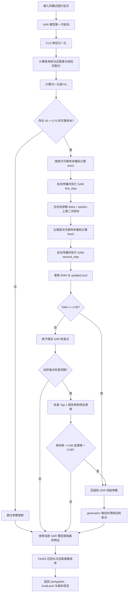

# CampusLens SAR 在线适配实现说明

**版本**：v2.1
**最后更新**：2026-06-13

## 1. 文档定位

本文说明 CampusLens 当前代码中的 SAR（Sharpness-Aware and Reliable Entropy Minimization）集成方式。内容以 `algorithm/app`、`.env.example` 和现有测试记录为准，不把原论文实验结果直接视为本项目效果。

当前实现用于验证校园地标检索场景下的持续测试时自适应，已具备以下能力：

- 基准模型与 SAR 模型双轨运行；
- 基于检索分数熵的可靠样本门控；
- 使用 SAM 对归一化层参数执行双步更新；
- SAR 状态持久化、跨实例读取和版本一致性检查；
- 低熵 EMA、锚点 Top-1 保持率和特征漂移三类回退保护；
- 校正样本审核与索引重建链路隔离。

上述能力表示链路已实现并通过现有测试，不等同于已经证明 SAR 必然提高识别准确率。

## 2. 双轨运行方式

算法服务加载同一份 DINOv2 权重，并维护两条特征提取轨道：

| 请求模式 | 使用模型 | 行为 |
| --- | --- | --- |
| `sarMode=false` | 不可变基准模型 | 只提取特征和检索，不更新参数 |
| `sarMode=true` | 可变 SAR 模型 | 先执行可靠性门控和可选更新，再使用更新后的模型特征检索 |

单图接口为 `POST /api/v1/search`。批量接口为 `POST /api/v1/search/batch`，当前由 `SEARCH_BATCH_SIZE` 限制为最多 2 张图片。批量接口会在同一个受控推理批次中处理图片，不是“提交任务后轮询”的接口；轮询只用于异步索引重建任务。

## 3. SAR 请求执行流程

当请求携带 `sarMode=true` 时，主要流程如下：

1. `FeatureService` 刷新共享 SAR 状态，并在版本锁内执行本次请求。
2. `DINOv2Extractor` 将图片组成批次，调用 `SARAdapter.adapt_batch()`。
3. SAR 模型提取归一化 CLS 特征，并对所有地标统计量计算马氏距离和经验匹配分。
4. 将所有地标分数经过温度 softmax 后计算归一化熵。
5. 熵低于 `SAR_ENTROPY_THRESHOLD` 的样本进入可靠样本集合。
6. 若集合非空，使用同一可靠样本掩码执行 SAM 双步更新，并更新 EMA 和计数器。
7. 更新后检查 EMA；通过后保存检查点，并按间隔执行锚点稳定性检查。
8. 使用最终 SAR 模型重新提取特征，执行 FAISS 召回和马氏距离重排序。
9. 根据最终 Top-K 结果计算展示侧信任等级，返回 `sarApplied`、`trustLevel` 和各版本信息。

如果更新后触发自动回退，本次响应的 `sarApplied` 会被置为 `false`，并使用回退后的 SAR 模型重新提取特征。

## 4. 两类熵的用途

当前代码中存在两处归一化熵计算，二者采用相同的温度 softmax 和 Shannon entropy 形式，但候选集合与用途不同。

### 4.1 模型更新门控

`SARAdapter` 使用当前全部地标统计量生成分数：

$$
p_i = \frac{\exp(s_i / T)}{\sum_j \exp(s_j / T)}
$$

$$
H = \frac{-\sum_i p_i \log p_i}{\log K}
$$

当 `H < SAR_ENTROPY_THRESHOLD` 时，该样本允许参与 SAR 更新。默认阈值为 `0.70`。

### 4.2 返回结果信任等级

检索完成后，`SearchService` 对返回的 Top-K 经验匹配分再次计算归一化熵，`Scoring` 按以下默认门限生成 `trustLevel`：

| Top-K 熵范围 | 信任等级 |
| --- | --- |
| `entropy < 0.35` | `trusted` |
| `0.35 <= entropy < 0.70` | `uncertain` |
| `entropy >= 0.70` | `untrusted` |

因此，`trustLevel` 是结果展示和业务核验信号，不应与“本次是否执行了 SAR 更新”直接画等号；是否更新应读取 `sarApplied`。

## 5. SAM 双步更新

当前实现只开放模型中 `LayerNorm`、`BatchNorm2d` 和 `GroupNorm` 的 `weight`、`bias` 参数，其余参数保持冻结。

### 双前向传播与回退流程



图中的 `0.70`、`0.05`、`0.90` 和 `0.08` 均为当前默认配置，可通过环境变量调整。自动回退后，本次响应会将 `sarApplied` 置为 `false`。

更新步骤为：

1. 在原参数位置计算可靠样本的平均熵并反向传播；
2. `SAM.first_step()` 将参数移动到邻域扰动点；
3. 在扰动参数上重新前向，继续使用第一次计算出的可靠样本掩码；
4. 计算第二次平均熵并反向传播；
5. `SAM.second_step()` 恢复扰动并执行基础优化器更新；
6. 使用第二次损失更新 EMA。

基础优化器为 Adam，默认学习率为 `0.0001`，SAM 扰动半径 `rho` 默认为 `0.05`。

## 6. 状态保存与自动回退

一次有效 SAR 更新完成后，服务会原子保存：

- 归一化层参数；
- Adam 优化器状态；
- EMA；
- 更新次数和 generation；
- 基准模型版本、活动索引版本和保存时间。

服务重启或另一实例刷新共享状态时，只有基准模型版本和索引版本匹配，检查点才可恢复。

当前回退条件如下：

| 条件 | 默认值 | 行为 |
| --- | ---: | --- |
| `EMA <= SAR_COLLAPSE_EMA_THRESHOLD` | `0.05` | 回退到 SAR 初始参数 |
| 锚点 Top-1 保持率低于阈值 | `0.90` | 回退 |
| 锚点平均特征漂移超过阈值 | `0.08` | 回退 |

锚点检查默认每累计 10 次更新执行一次。回退后 generation 增加、更新计数清零，并删除旧检查点。

## 7. 校正样本与反馈边界

用户反馈入口属于后端业务接口：

```text
POST /api/feedback
```

算法服务接收后端校正样本的接口为：

```text
POST /api/v1/adaptation/correction-samples
```

该接口接收图片、已确认地标、原 Top 结果和反馈信息，计算 `suggestAccept`、`reviewScore`、`sarEligible` 与 `nextAction`，并追加本地 manifest。它不会直接用用户标签更新 SAR 模型。

被后端采纳的样本先进入待发布目录，只有后续索引重建成功并完成原子切换后，才进入正式检索索引。这样可以避免未经审核的反馈直接污染在线模型和活动索引。

## 8. 主要配置

| 配置项 | 默认值 | 作用 |
| --- | ---: | --- |
| `SAR_ENABLED` | `true` | 全局 SAR 开关；请求仍需显式设置 `sarMode=true` |
| `SAR_STEPS` | `1` | 单次请求的 SAM 更新轮数 |
| `SAR_ENTROPY_TEMPERATURE` | `0.15` | 分数 softmax 温度 |
| `SAR_ENTROPY_THRESHOLD` | `0.70` | 模型更新可靠样本阈值 |
| `SAR_LEARNING_RATE` | `0.0001` | Adam 学习率 |
| `SAR_RHO` | `0.05` | SAM 扰动半径 |
| `SAR_EMA_ALPHA` | `0.9` | EMA 衰减系数 |
| `SAR_COLLAPSE_EMA_THRESHOLD` | `0.05` | 低熵回退阈值 |
| `SAR_ANCHOR_CHECK_INTERVAL` | `10` | 锚点检查间隔 |
| `SAR_ANCHOR_TOP1_RETENTION` | `0.90` | 锚点 Top-1 最低保持率 |
| `SAR_FEATURE_DRIFT_THRESHOLD` | `0.08` | 锚点平均特征漂移上限 |
| `TRUST_LOW_THRESHOLD` | `0.35` | `trusted` 上界 |
| `TRUST_HIGH_THRESHOLD` | `0.70` | `uncertain` 上界 |

## 9. 代码位置

| 文件 | 职责 |
| --- | --- |
| `app/models/sar_adapter.py` | 可靠性门控、SAM 更新、EMA 和参数状态导入导出 |
| `app/models/dinov2_extractor.py` | 基准/SAR 双模型和批量特征提取 |
| `app/services/feature_service.py` | SAR 状态持久化、共享刷新、锚点检查和回退 |
| `app/services/search_service.py` | 检索编排、Top-K 熵和响应元数据 |
| `app/utils/scoring.py` | 经验匹配分、归一化熵和信任等级 |
| `app/utils/sam_optimizer.py` | SAM 两步优化器 |
| `app/api/routes.py` | 单图、批量、运行状态、索引重建和校正样本接口 |

## 10. 验证结果与实现边界

现有自动化和运行记录已覆盖：

- 普通/SAR 双轨检索；
- 同模式微批次联合更新；
- SAR 检查点保存与重启恢复；
- 版本不一致时拒绝恢复；
- EMA 和锚点异常回退；
- 异步索引重建及活动索引原子切换；
- 校正样本待发布流程。

当前小样本验证中，基准轨道与持续 SAR 的 Top-1、Top-5 均未退化，但该结果不能替代夜景、模糊、遮挡、角度变化等独立测试集上的准确率对照实验。性能数据和测试条件见：

- [持续 SAR 双轨运行验证记录](../docs/14_sar_online_adaptation_test.md)
- [完整系统验收记录](../docs/15_full_system_acceptance_test.md)

当前实现不属于完整的生产级在线学习系统。阈值仍是经验参数，真实部署前需要扩大数据集并完成离线回放、准确率对照、漂移场景和长期稳定性测试。

## 11. 与原论文的关系

本项目借鉴原 SAR 论文中的可靠样本筛选、SAM 更新和模型恢复思想，但将分类 logits 熵改为基于校园地标统计分数构造的检索熵，并增加了双轨模型、版本绑定、持久化和锚点回退机制。因此，原论文在 ImageNet-C 上的结果不能直接作为 CampusLens 的实验结果。

论文：Shuaicheng Niu et al., *Towards Stable Test-Time Adaptation in Dynamic Wild World*, ICLR 2023。

```bibtex
@inproceedings{niu2023towards,
  title={Towards Stable Test-Time Adaptation in Dynamic Wild World},
  author={Niu, Shuaicheng and Wu, Jiaxiang and Zhang, Yifan and Wen, Zhiquan and Chen, Yaofo and Zhao, Peilin and Tan, Mingkui},
  booktitle={International Conference on Learning Representations},
  year={2023}
}
```
