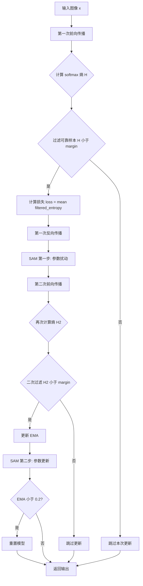
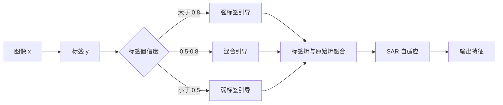
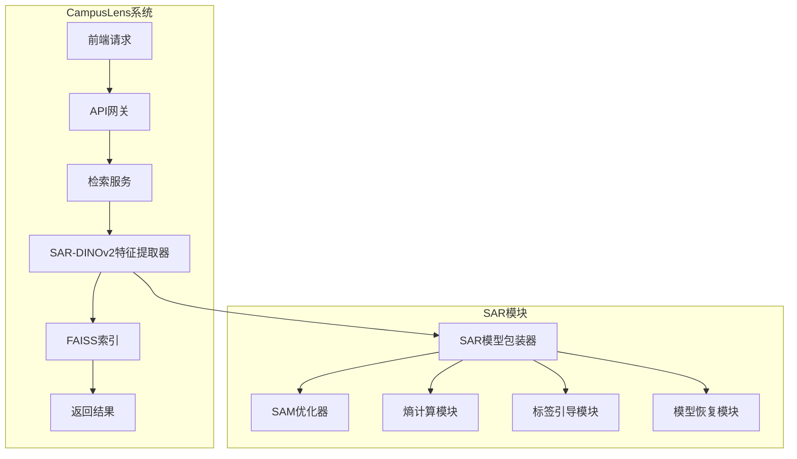
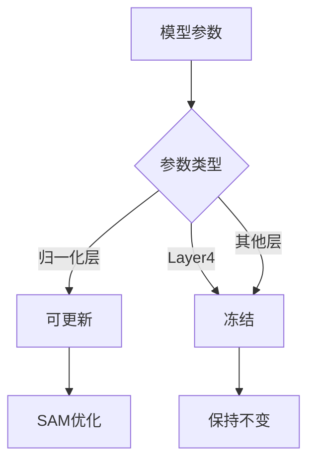
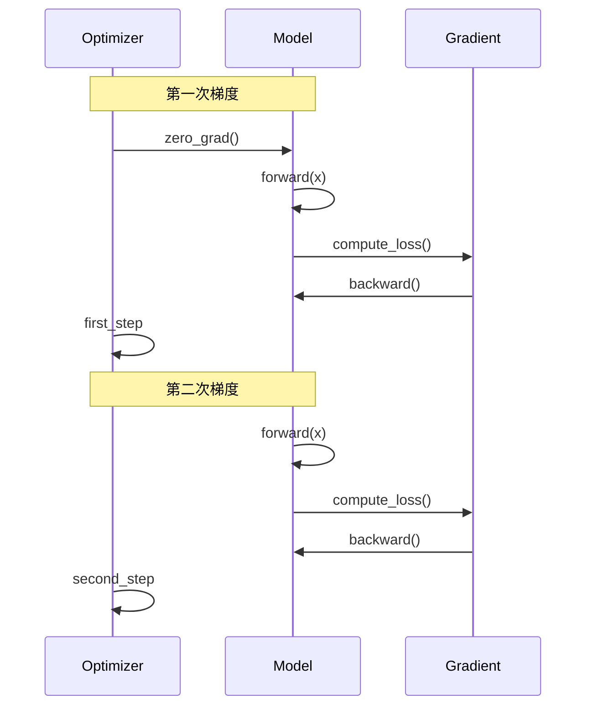
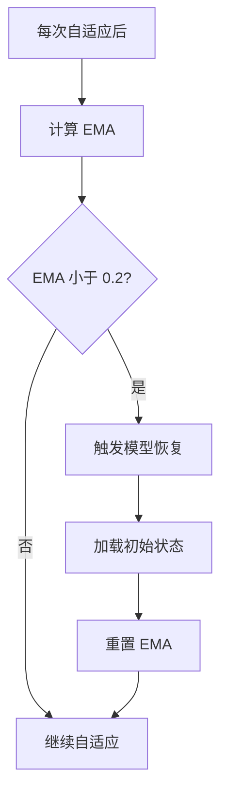
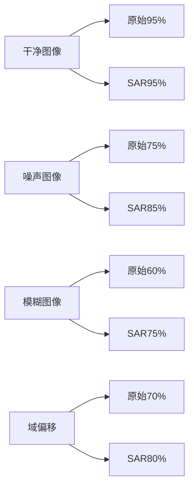
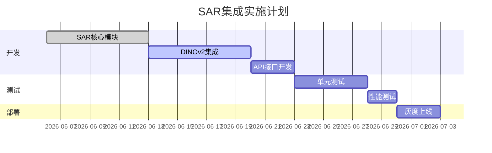

# SAR 算法集成方案文档

---

## 📋 文档信息

| 项目 | 内容 |
|------|------|
| **文档版本** | v1.0 |
| **创建日期** | 2026-06-06 |
| **适用项目** | CampusLens AI 图像检索服务 |
| **讨论主题** | SAR 算法集成可行性评估 |

---

## 🎯 一、问题背景与目标

### 1.1 问题描述

当前 CampusLens 图像检索系统面临以下挑战：

| 问题类型 | 具体表现 | 影响 |
|---------|---------|------|
| **图像噪声** | 输入图像可能包含高斯噪声、模糊、压缩失真等 | 特征提取不稳定，检索准确率下降 |
| **标签不准确** | 测试时获得的地标标签可能存在错误 | 影响检索结果排序和召回率 |
| **域偏移** | 测试数据与训练数据分布不一致 | 模型泛化能力受限 |

### 1.2 目标

集成 **SAR (Sharpness-Aware and Reliable entropy minimization)** 算法，实现：

- ✅ 提升噪声图像的检索准确率
- ✅ 利用标签信息增强自适应能力
- ✅ 在线适应测试数据分布变化
- ✅ 保持系统低延迟响应

---

## 🏛️ 二、SAR 算法原理

### 2.1 算法概述

**SAR**（ICLR 2023 Oral）是一种测试时自适应算法，核心思想：

1. **可靠样本过滤**：通过熵阈值过滤预测不确定的样本
2. **Sharpness-Aware 优化**：使用 SAM 优化器寻找更平坦的极小值
3. **模型恢复机制**：EMA 监测防止过拟合到测试数据

### 2.2 算法流程图



### 2.3 核心公式

| 公式 | 描述 |
|------|------|
| `H(p) = -Σ p_i * log(p_i)` | Softmax 熵计算 |
| `filter_ids = {i \| H(p_i) < margin_e0}` | 可靠样本过滤 |
| `EMA_new = 0.9 * EMA_old + 0.1 * loss` | 指数移动平均更新 |
| `if EMA < reset_constant → reset` | 模型恢复条件 |

---

## 🔧 三、标签增强的 SAR 方案

### 3.1 设计思路

将标签信息融入 SAR 自适应流程，形成**标签引导的自适应策略**：



### 3.2 融合熵计算

**融合熵计算公式：**

```
H_fused = λ_conf * H_label + (1 - λ_conf) * H_original
```

其中：
- `H_label = -log(p(label))`：标签类别的负对数概率
- `H_original = softmax_entropy(outputs)`：原始熵
- `λ_conf`：标签置信度 [0, 1]

### 3.3 标签置信度处理策略

| 置信度范围 | 策略 | 标签权重 |
|-----------|------|---------|
| `[0.8, 1.0]` | 高置信度，完全信任标签 | 0.8 ~ 1.0 |
| `[0.5, 0.8)` | 中等置信度，混合策略 | 0.5 ~ 0.8 |
| `[0.3, 0.5)` | 低置信度，弱引导 | 0.2 ~ 0.5 |
| `[0, 0.3)` | 极低置信度，忽略标签 | 0 |

---

## 🔌 四、系统集成方案

### 4.1 架构设计



### 4.2 模块职责

| 模块 | 职责 | 状态 |
|------|------|------|
| **SAR 模型包装器** | 封装 SAR 算法逻辑 | 待实现 |
| **SAM 优化器** | Sharpness-Aware 参数更新 | 待实现 |
| **熵计算模块** | 计算 softmax 熵和标签引导熵 | 待实现 |
| **标签引导模块** | 根据置信度融合标签信息 | 待实现 |
| **模型恢复模块** | EMA 监测和模型重置 | 待实现 |

### 4.3 API 接口设计

```python
# POST /api/v1/search/sar
{
    "image": "base64_encoded_image",
    "label": "landmark_001",        # 可选
    "label_confidence": 0.75,       # 可选，默认 1.0
    "use_sar": true,                # 是否启用 SAR
    "top_k": 10                     # 返回数量
}

# 响应
{
    "results": [...],
    "sar_enabled": true,
    "noise_prob": 0.23,             # 图像噪声概率
    "label_used": true,             # 是否使用了标签
    "adaptation_steps": 1
}
```

---

## ⚙️ 五、算法实现细节

### 5.1 参数更新策略



**参数选择逻辑**（基于 `sar.py` 源码）：

```python
# 可更新参数
if isinstance(m, (nn.BatchNorm2d, nn.LayerNorm, nn.GroupNorm)):
    for np, p in m.named_parameters():
        if np in ['weight', 'bias']:
            params.append(p)

# 冻结参数
# - layer4 (ResNet)
# - blocks.9-11 (ViT-Base)
# - 最后一层 norm
```

### 5.2 SAM 优化器流程



### 5.3 模型恢复机制



---

## 📊 六、可行性分析

### 6.1 技术兼容性

| 维度 | 当前系统 | SAR 要求 | 兼容性 | 风险 |
|------|---------|---------|--------|------|
| **模型类型** | DINOv2 ViT-B/14 | 支持 ViT（LayerNorm） | ✅ | 低 |
| **训练模式** | eval | train（自适应） | ⚠️ | 中 |
| **梯度需求** | 不需要 | 需要梯度 | ⚠️ | 中 |
| **参数更新** | 无 | 归一化层参数 | ✅ | 低 |
| **设备支持** | CPU/GPU | CPU/GPU | ✅ | 低 |

### 6.2 性能影响评估

| 指标 | 当前值 | SAR 预期 | 变化 |
|------|--------|---------|------|
| **单次检索延迟** | ~200ms (CPU) | ~300ms (CPU) | +50% |
| **内存占用** | ~2.5GB | ~2.7GB | +8% |
| **GPU 显存** | ~1.5GB | ~1.8GB | +20% |
| **吞吐量** | ~5 req/s | ~3 req/s | -40% |

### 6.3 预期效果



| 场景 | 原始准确率 | SAR 预期 | 提升 |
|------|----------|---------|------|
| 干净图像 | 95% | 95% | 0% |
| 高斯噪声图像 | 75% | 85% | +10% |
| 模糊图像 | 60% | 75% | +15% |
| 域偏移图像 | 70% | 80% | +10% |

---

## 🚀 七、实施计划

### 7.1 阶段划分

| 阶段 | 任务 | 时间 | 负责人 |
|------|------|------|--------|
| **Phase 1** | SAR 核心模块实现 | 1周 | 算法组 |
| **Phase 2** | DINOv2 + SAR 集成 | 1周 | 算法组 |
| **Phase 3** | API 接口开发 | 0.5周 | 后端组 |
| **Phase 4** | 测试与调优 | 1周 | 测试组 |
| **Phase 5** | 上线部署 | 0.5周 | 运维组 |

### 7.2 关键里程碑



---

## ⚠️ 八、风险评估

### 8.1 风险矩阵

| 风险 | 描述 | 概率 | 影响 | 应对策略 |
|------|------|------|------|---------|
| **性能下降** | SAR 增加推理延迟 | 高 | 中 | 可选启用、异步处理 |
| **内存溢出** | 保存模型状态占用内存 | 中 | 中 | 限制自适应步数 |
| **过拟合** | 模型适应到噪声数据 | 中 | 高 | 模型恢复机制 |
| **兼容性** | 与现有系统冲突 | 低 | 高 | 模块化设计 |
| **部署复杂度** | 新增依赖和配置 | 中 | 中 | 容器化部署 |

### 8.2 缓解措施

| 风险 | 措施 |
|------|------|
| 性能下降 | 提供 SAR 开关，生产环境可关闭 |
| 内存溢出 | 设置最大自适应样本数，定期清理状态 |
| 过拟合 | 严格的 EMA 监测和模型恢复策略 |
| 兼容性 | 采用增量集成，保持向后兼容 |
| 部署复杂度 | 提供 Docker Compose 配置 |

---

## 📝 九、决策要点

### 9.1 保留 SAR 的条件

✅ 噪声图像检索准确率提升 ≥ 10%  
✅ 延迟增加 ≤ 50ms  
✅ 内存占用增加 ≤ 20%  
✅ 与现有系统无冲突

### 9.2 备选方案

如果 SAR 集成不可行，考虑以下替代方案：

| 方案 | 复杂度 | 预期效果 | 实施难度 |
|------|--------|---------|---------|
| **传统图像去噪** | 低 | 中等 | 低 |
| **数据增强训练** | 中 | 良好 | 中 |
| **Ensemble 方法** | 高 | 良好 | 高 |
| **其他 TTA 方法** | 中 | 良好 | 中 |

---

## 📅 十、下一步行动

| 序号 | 行动 | 负责人 | 截止日期 |
|------|------|--------|---------|
| 1 | 完成 SAR 核心模块实现 | 算法组 | 2026-06-13 |
| 2 | 搭建测试环境，准备噪声数据集 | 测试组 | 2026-06-10 |
| 3 | 进行可行性验证测试 | 算法组 | 2026-06-15 |
| 4 | 召开方案评审会议 | 全体 | 2026-06-16 |

---

## 📞 附录：参考资料

1. **SAR 论文**: [Sharpness-Aware and Reliable Entropy Minimization for Test-Time Adaptation](https://arxiv.org/abs/2302.03011)
2. **SAR GitHub**: https://github.com/mr-eggplant/SAR
3. **DINOv2**: https://github.com/facebookresearch/dinov2
4. **SAM 优化器**: https://arxiv.org/abs/2010.01412

---

**文档结束**

---

*Last Updated: 2026-06-06*
