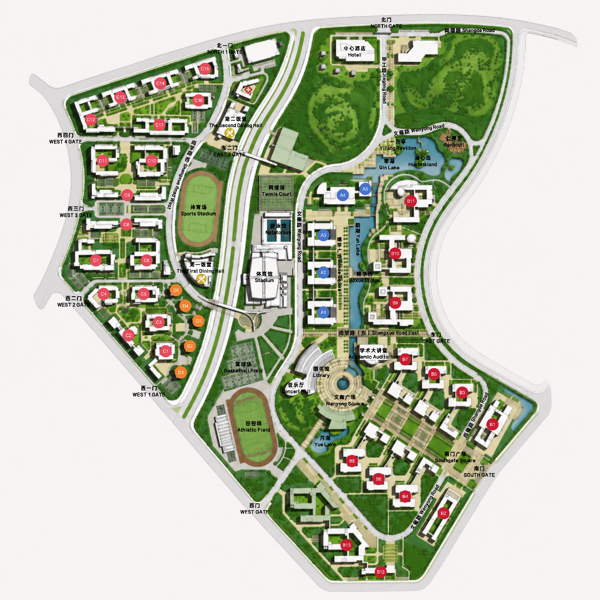

# 前端界面原型说明

## 原型目标

第一周前端原型用于明确用户端主流程，不追求复杂视觉效果，重点保证页面结构清晰、信息层级稳定、可截图纳入课程文档。

## 页面组成

| 页面区域 | 对应模块 | 展示内容 |
| --- | --- | --- |
| 图片上传区 | M1 | 文件选择、上传并检索按钮、错误提示 |
| Top-5 结果区 | M1 / M4 | 排名、地标名称、英文名、位置、简介、置信度评分、详情入口、反馈入口 |
| 地标详情区 | M2 / M4 | 地标编号、类型、位置说明、地图坐标、样本要求 |
| 静态地图区 | M4 | 校园平面图和 L01-L10 百分比坐标标注 |
| 反馈表单 | M5 | 反馈类型、正确地标、补充说明、提交结果 |

## 地图素材

静态地图当前使用项目根目录中的压缩平面图，已归档到 `docs/assets/campus-map.png`。前端运行时使用同一素材复制件 `frontend/public/campus-map.png`。

## 原型截图

原型截图生成后归档在 `docs/prototypes/`，用于补充第一周 Word 文档的界面原型部分。

计划截图包括：

- `prototype-results.png`：上传检索与 Top-5 结果页。
- `prototype-map.png`：静态地图标注页。
- `prototype-feedback.png`：用户反馈纠错页。
