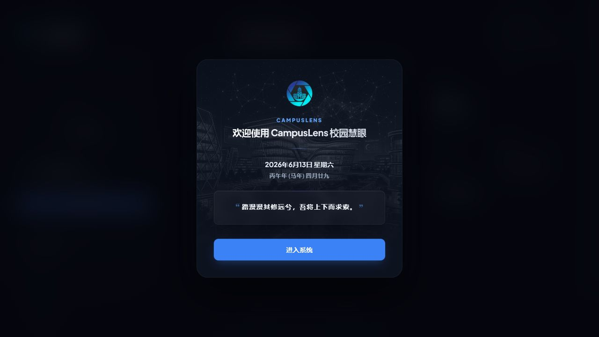

# CampusLens 全链路修复与验收记录

## 1. 验收范围

验收时间为 2026 年 6 月 12 日至 6 月 13 日，覆盖上传检索、普通/SAR 模式、管理员登录、反馈采纳、索引重建与原子发布、双实例故障转移、局域网 HTTP/HTTPS、并发压测和验收后状态恢复。

## 2. 环境基线

| 项目 | 实际环境 |
| --- | --- |
| 操作系统 | Windows，PowerShell，Asia/Shanghai |
| 算法 Python | `D:\AnaConda\envs\campuslens-gpu\python.exe` |
| PyTorch | `2.1.2+cu121` |
| CUDA | PyTorch CUDA `12.1`，`torch.cuda.is_available() = true` |
| GPU | NVIDIA GeForce RTX 4060 Laptop GPU，8192 MiB |
| Docker | Docker Desktop，客户端/服务端 `29.4.3` |
| Docker Desktop | `D:\Tools\Docker\Docker` |
| Docker 数据 | `D:\DockerData\wsl`，Docker Desktop Linux 后端数据目录 |
| 数据服务 | MySQL 8.4、Redis 7.4-alpine，Compose 命名卷持久化 |
| 算法实例 | primary `8000`，secondary `8001` |
| 前端 | HTTP `5173`，自签名 HTTPS `5174` |

## 3. 修复结果

1. 上传接口将 `guestId`、`sarMode` 改为 multipart 文本参数，`sarMode=false/true` 均返回 `202`，原 `415 Unsupported Media Type` 不再出现。
2. 前端幂等键优先使用 `crypto.randomUUID()`，其次使用 `crypto.getRandomValues()`，Web Crypto 不可用时仍能生成 UUID v4 格式，局域网非安全 HTTP 上下文不会因 UUID API 缺失而中断上传。
3. Vite 同时启动 HTTP `5173` 和 HTTPS `5174`，两者均同源代理 `/api`、`/uploads`。证书 SAN 包含 localhost、127.0.0.1 和验收时 WLAN IP `192.168.2.108`。
4. 算法服务改为主备两个独立进程；后端对连接失败、超时和 5xx 在同一次请求内切换实例，4xx 不重试；重建和管理操作固定由主实例处理。
5. 活动索引指针和 SAR checkpoint 使用跨进程文件锁与 `os.replace` 发布。两个实例在请求前检测共享版本并热加载，响应和检索记录保存实际实例 ID/角色。
6. FAISS 持久化改为内存序列化后由 Python 文件 API 写入，修复 Windows 中文路径下 `faiss::FileIOWriter` 无法创建文件的问题。
7. SAR 全链路强制单任务调度，普通检索仍可批量 2；修复 8 GB 显存上双实例常驻时 SAR 双任务批次超时的问题。
8. 停止脚本按端口、真实 Python PID、父启动器 PID 和 PID 文件清理，修复旧备用实例残留并持续占用显存的问题。

## 4. 真实业务流程

管理员 `admin/admin` 登录成功；使用 `L01_back_day_005.jpg` 完成普通与 SAR 检索。普通检索记录 `116` 返回 primary、`sarApplied=false`；SAR 检索记录 `117` 返回 primary、`sarApplied=true`。两次 Top-5 均为：`L01`、`L02`、`L03`、`L10`、`L08`，Top-1 为图书馆。

对记录 `116` 提交 `correct` 反馈后，反馈记录进入 `pending`；管理员采纳后状态变为 `accepted`，生成 `correction_sample`，状态为 `pending_index`，图片写入 `datasets/landmarks/L01_library/pending_index/feedback-1.jpg`。

## 5. 索引重建与原子切换

首次重建在候选索引写盘阶段暴露 Windows 中文路径兼容问题。该次任务失败时，活动指针仍为空，在线检索继续使用 `index-baseline-ae2463fa7079`，旧 manager 未被替换，验证了失败回滚路径。

修复后第二次重建处理 213 张图片，耗时约 590.9 秒，发布版本 `index-da277112-6aa9-423b-8a26-2092550c75cd`。重建期间 6 次普通/SAR 交替检索全部成功并持续读取旧 baseline，没有读取半成品。发布后：

- 活动指针原子切换到新版本；
- primary 与 secondary 自动同步同一索引版本；
- SAR 从 `g1-u4` 重置为 `g2-u0`；
- 校正样本变为 `published`；
- 新索引上的普通和 SAR 检索均返回 Top-1 `L01`。

## 6. 主备切换

停止 primary 后，普通记录 `126` 和 SAR 记录 `127` 均在同一次任务内由 `algorithm-secondary` 成功处理，`attemptCount=1`。恢复 primary 并等待 10 秒冷却期后，记录 `128` 自动回到 `algorithm-primary`。secondary 上的 SAR 请求实际应用适配，主备实例共享 checkpoint。

## 7. HTTP、HTTPS 与局域网

以下入口均验证页面、`/api/health` 和 `/uploads` 图片返回 `200`：

- `http://localhost:5173`
- `http://192.168.2.108:5173`
- `https://localhost:5174`
- `https://192.168.2.108:5174`

后端 CORS 对 `http://192.168.2.108:5173` 和 `https://192.168.2.108:5174` 均正确返回对应 `Access-Control-Allow-Origin`。HTTPS 为自签名证书，浏览器首次访问显示预期警告；自动化未绕过安全警告，命令行在显式忽略自签名信任后完成 HTTPS 页面、API 和图片验证。页面无 HTTPS 请求 HTTP 后端的混合内容路径。

## 8. 分档压测

下表记录算法检索和全链路任务完成阶段；六档 HTTP 与业务成功率均为 100%。

| 档位 | 模式 | 算法请求 | 算法吞吐 | 算法 P95/P99 | 全链路任务 | 全链路吞吐 | 全链路 P95/P99 | 显存峰值 |
| --- | --- | ---: | ---: | ---: | ---: | ---: | ---: | ---: |
| 低 | 普通 | 5/5 | 1.669 rps | 1885/2226 ms | 10/10 | 3.805 rps | 528/530 ms | 7378 MiB |
| 低 | SAR | 5/5 | 0.596 rps | 2883/3200 ms | 10/10 | 0.716 rps | 3106/3109 ms | 7347 MiB |
| 中 | 普通 | 20/20 | 3.727 rps | 2547/2670 ms | 20/20 | 3.825 rps | 1058/1060 ms | 7506 MiB |
| 中 | SAR | 20/20 | 1.275 rps | 4373/4869 ms | 20/20 | 1.215 rps | 3625/4012 ms | 7304 MiB |
| 高 | 普通 | 50/50 | 6.780 rps | 2983/3180 ms | 50/50 | 5.093 rps | 2080/2341 ms | 7678 MiB |
| 高 | SAR | 50/50 | 1.442 rps | 7341/8708 ms | 50/50 | 1.279 rps | 8217/8725 ms | 7693 MiB |

查询接口阶段同样全部成功：低档 `100/100`，中档 `500/500`，高档 `2000/2000`。所有正常压测任务由 primary 处理；secondary 只在故障转移测试中接管，符合主实例优先策略。

## 9. 自动化回归

- Spring Boot 后端测试：通过，Flyway V1-V14 全部应用；
- Python 算法测试：`21 passed`；
- Vue 前端：`npm run build` 成功；
- multipart `sarMode=false/true` 回归测试通过；
- FAISS 中文路径持久化和共享索引加载失败保留旧 manager 的回归测试通过。

## 10. 验收后清理

验收结束后按基线 `search_record=115`、`feedback=0`、`correction_sample=0`、`index_rebuild_job=0` 清理本轮数据库记录和 223 个上传文件，删除待发布样本、压测 JSON/日志、新索引版本、活动指针和测试 SAR checkpoint。随后重启双算法实例、后端、HTTP/HTTPS 前端，并通过健康检查与直接算法样本检索确认恢复到原 `index-baseline-ae2463fa7079`。

## 11. 2026-06-13 运行配置变更

上述 HTTP `5173` 与 HTTPS `5174` 内容保留为验收时事实。当前日常启动已收敛为单个自签名 HTTPS 前端 `https://localhost:5173`，不再监听 HTTP 或 `5174`。游客编号改由后端 `guest_identity` 表统一分配，并由浏览器令牌幂等复用。
